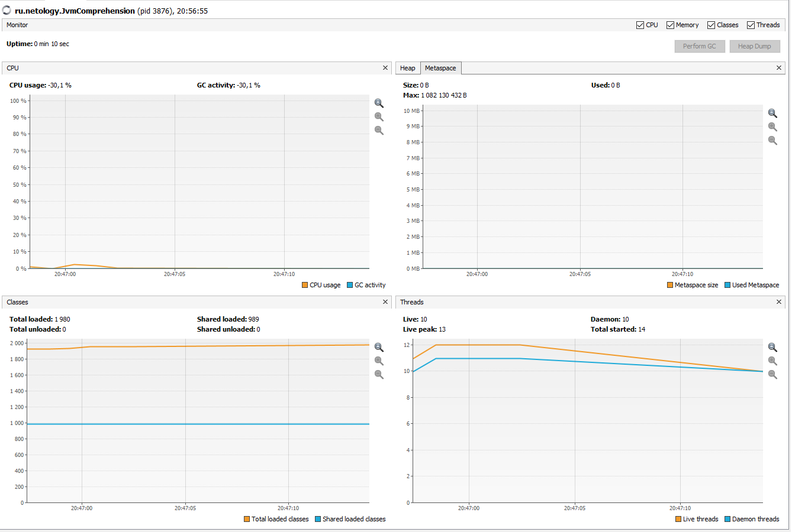
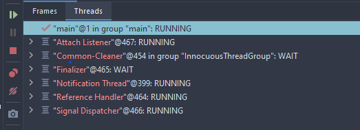
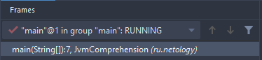
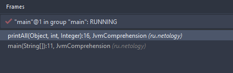

# Задача "Понимание JVM"

```java
public class JvmComprehension {

    public static void main(String[] args) {
        int i = 1;                      // 1
        Object o = new Object();        // 2
        Integer ii = 2;                 // 3
        printAll(o, i, ii);             // 4
        System.out.println("finished"); // 7
    }

    private static void printAll(Object o, int i, Integer ii) {
        Integer uselessVar = 700;                   // 5
        System.out.println(o.toString() + i + ii);  // 6
    }
}
```

## Class Loader Subsystem

При запуске программы JVM загружает необходимые классы в RAM посредством подсистемы загрузчиков классов 
(Class Loader Subsystem). Данная система во время исполнения программы загружает, связывает и инициализирует необходимые классы. 

### Загрузка (loading)

Основные классы (java.base) загружает Bootstrap Classloader. Он реализован на нативном коде, поэтому если выполнить, например,
для Object o = new Object() .getClassLoader() он будет отображаться как null;
```
System.out.printl(o.getClass().getClassLoader()) --> null
```

Platform ClassLoader отвечает за загрузку модулей Java SE и JDK. Например:  
```
System.out.println(SQLOutput.class.getClassLoader()); --> jdk.internal.loader.ClassLoaders$PlatformClassLoader@eed1f14
``` 

Загрузка классов на уровне приложения производится Application ClassLoader. Сюда входят, в том числе и классы, написанные нами.
Загрузка обычно начинается с класса, который содержит метод main(). 
```
System.out.println(JvmComprehension.class.getClassLoader()); --> jdk.internal.loader.ClassLoaders$AppClassLoader@4e0e2f2a
```

### Связывание (linking)

Выполняется проверка (verification), подготовка (preparation) и разрешение (resolving).
- проверка - проверка корректности байт-кода, например корректные ли значения у переменных, или соответствие количества 
и типов параметров методов итд;
- подготовка - выделение памяти для статических полей и их заполнение дефолтными значениями;
- разрешение - символьные ссылки преобразуются в прямые.  

### Инициализация (initialization) 

Выполняются static блоки кода, static поля инициализируются реальными значениями из кода.


Если прогнать эту программу через VisualVM, то окажется, что для такой в общем-то простой программы загружено почти 2000 классов:


А если в IDEA в configuration в VM options поставить -verbose:class то можно увидеть, что наш класс JvmComprehension 
загружается только 441-м по счету: 
- [неудобный лог](jvm_comprehension_log.txt), 
- [удобная таблица в гугл-диске](https://docs.google.com/spreadsheets/d/1CAQqH-7szNPg5ENZlNrorxTJflL6Zk3R9uiVNEsGJQ4/edit?usp=sharing).

## Runtime Data Area

Состоит из metaspace, heap и stack. Metaspace и heap общие для всех потоков, stack создается для каждого потока свой.

Помимо чтения .class файлов класслоадеры загружают в metaspace информацию о каждом классе, а именно: полное имя 
класса и его родителя, тип (класс, интерфейс, Enum), модификаторы доступа, статические переменные и информацию о методах.
Дальше для каждого .class создается один объект этого класса для его представления в heap.

Если на этапе загрузки не возникло ошибок, JVM переходит к выполнению программы.

## Execution engine

Собственно тут и выполняется байт-код при помощи интерпретатор и Just In Time (JIT) компилятора. В случае с нашей 
программой JIT скорее всего в процессе не участвует, т.к. для его задействования нужно чтобы один и тот же код повторялся 
в программе очень много раз (на лекции говорили, что от 1000 до 10000 раз). Объекты, на которые отсутствуют ссылки/недоступны 
из кода удаляются из хипа сборщиком мусора Garbage Collector (GC).    

## JvmComprehension

Для метода main() создается thread main(), помимо него JVM использует в своей работе и другие thread'ы.



Для этого потока создается stack, в котором в свою очередь создаются фреймы (frame) вызовов методов.



```java
// класслоадеры
public class JvmComprehension {

    public static void main(String[] args) {

// int - примитив, переменная i создается в стеке в фрейме метода main().

        int i = 1;                      // 1                     

// объекты cсылочных типов Object и Integer создаются в хипе, а в стеке хранятся только ссылки на них.
// если посмотреть лог, то можно увидеть, что эти классы были загружены загрузчиком задолго до класса JvmComprehension
// Object был загружен первым

        Object o = new Object();        // 2 
        Integer ii = 2;                 // 3

// при вызове метода printAll на вершине стека создается фрейм этого метода

        printAll(o, i, ii);             // 4

// в хипе в string pool будет создана строка с результатом "finished", на которую нет ссылок 
// -> будет впоследствии удалена сборщиком мусора     

        System.out.println("finished"); // 7

// при завершении метода все ссылки и локальные переменные будут удалены, задействованная память будет освобождена
    }

// в фрейме метода создаются новые ссылки на объекты ii и o + создается копия int i
    
    private static void printAll(Object o, int i, Integer ii) {

// в фрейме метода создается ссылка на объект uselessVar, который  будет создан в хипе 
// -> будет впоследствии удален сборщиком мусора, т.к. ссылок на него нигде кроме метода printAll нет 

        Integer uselessVar = 700;                   // 5

// в хипе в string pool будет создана строка с результатом o.toString() + i + ii, на которую нет ссылок 
// -> будет удалена сборщиком мусора 

        System.out.println(o.toString() + i + ii);  // 6

// при завершении метода все ссылки и локальные переменные будут удалены, задействованная память будет освобождена
    }
}
```

Фрейм метода printAll(...) на вершине стека:




 
 

