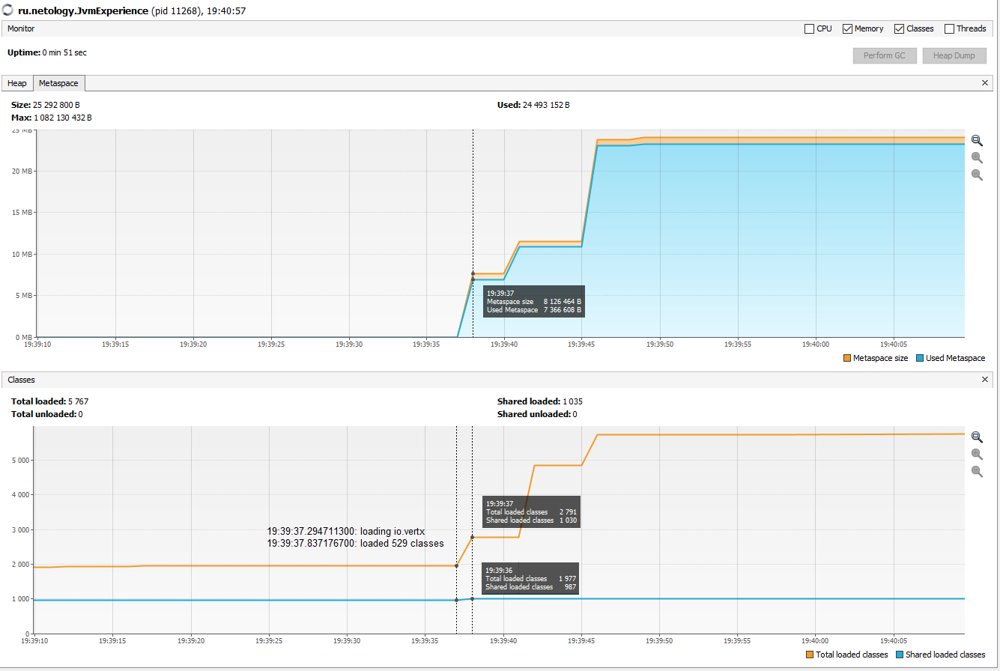
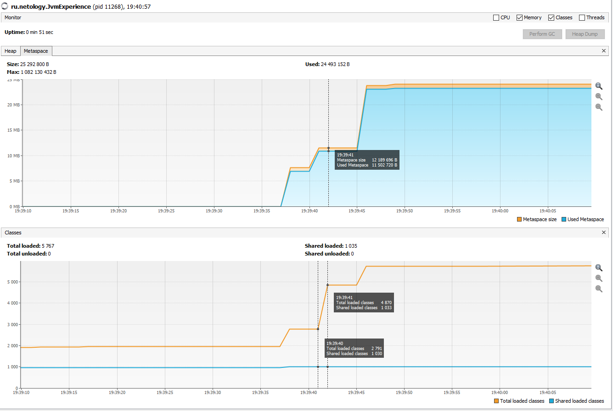
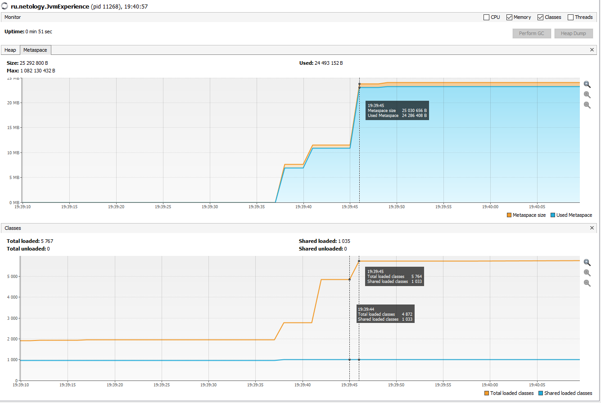
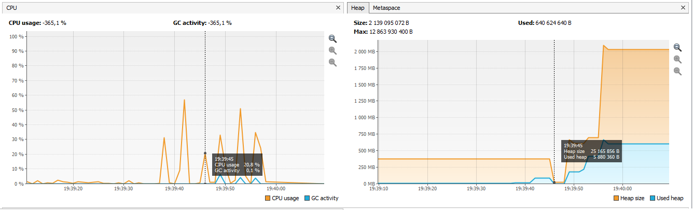
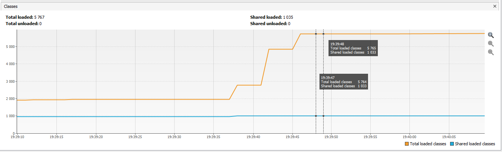
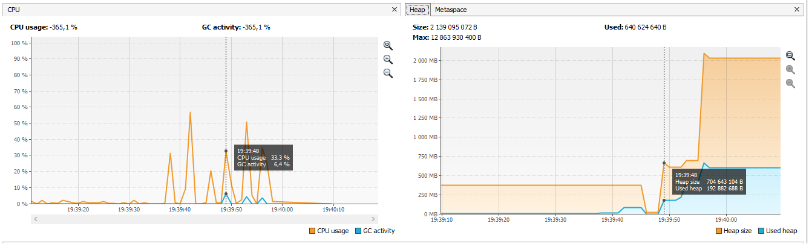
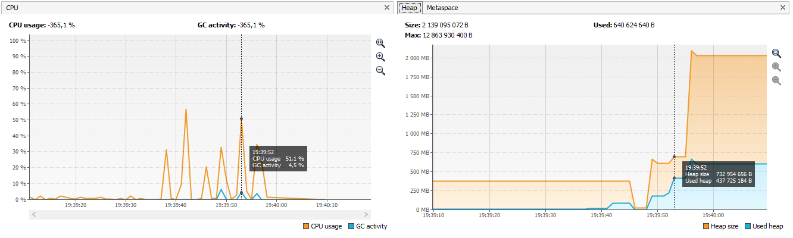
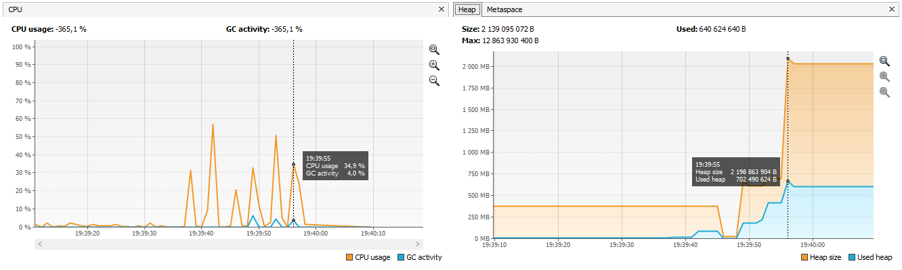

# Задача "Исследование JVM через VisualVM"

```
19:39:06: Executing task 'JvmExperience.main()'...

> Task :compileJava UP-TO-DATE
> Task :processResources NO-SOURCE
> Task :classes UP-TO-DATE

> Task :JvmExperience.main()
Please open 'ru.netology.JvmExperience' in VisualVm
19:39:37.294711300: loading io.vertx
19:39:37.837176700: loaded 529 classes
19:39:40.850383: loading io.netty
19:39:41.990381100: loaded 2117 classes
19:39:44.999255200: loading org.springframework
19:39:45.445452500: loaded 869 classes
19:39:48.446866900: now see heap
19:39:48.448865500: creating 5000000 objects
19:39:48.923383200: created
19:39:51.924911700: creating 5000000 objects
19:39:52.258725600: created
19:39:55.430424800: creating 5000000 objects
19:39:55.852408200: created


BUILD SUCCESSFUL in 52s
2 actionable tasks: 1 executed, 1 up-to-date
19:39:59: Task execution finished 'JvmExperience.main()'.
```

## metaspace

- [лог](https://docs.google.com/spreadsheets/d/1Js8OZRHeUVCpESHxZ1Ih5_xZK_FwMS2zVq5OBk7lHWA/edit?usp=sharing)

19:39:37.294711300: loading io.vertx

19:39:37.837176700: loaded 529 classes



Если посмотреть в лог, то можно заметить, что помимо 529 классов vertex между этими двумя строками также загрузилось
 org.reflections + некоторые классы io.netty, которые vertx видимо использует.
 
 19:39:40.850383: loading io.netty
 
 19:39:41.990381100: loaded 2117 classes
 
 
 
 Судя по логу и данным VisualVM, в реальности загружено было меньше 2117 классов, видимо дело в том, что некоторые классы netty 
 были загружены еще в vertx. Тут также VisualVM показывает, что в metaspace все было загружено в 19:39:40, а не в 19:39:41 как во 
 вкладке classes, скорее всего просто некорректное отображение, прогонял несколько раз, там иногда очень странные результаты 
 отображаются.  
 
 19:39:44.999255200: loading org.springframework
 
 19:39:45.445452500: loaded 869 classes
 

 
869 классов springframework + некоторые вспомогательные, например что-то из javax.xml, org.xml.sax = 892 класса по данным VisualVM. 


Хип в процессе загрузки и создания объектов также рос, а вот здесь отработал сборщик мусора.


## heap

Подгрузился SimpleObject

[41.363s][info][class,load] ru.netology.JvmExperience$SimpleObject source: file:/D:/Learning/IdeaProjects/javacore_visualvm/build/classes/java/main/



19:39:48.448865500: creating 5000000 objects

При создании первых пяти миллионов объектов значительно растет как heap size, так и used heap.

19:39:48.923383200: created



19:39:51.924911700: creating 5000000 objects

Рост продолжается.

19:39:52.258725600: created


19:39:55.430424800: creating 5000000 objects

Предполагаю, что активность сборщика мусора на этих этапах связана с расширением ArrayList.

19:39:55.852408200: created


